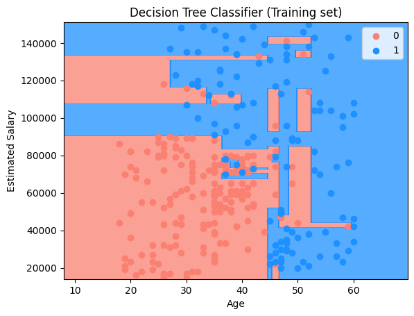
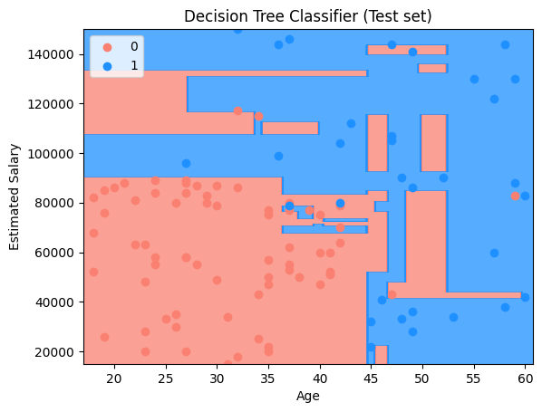
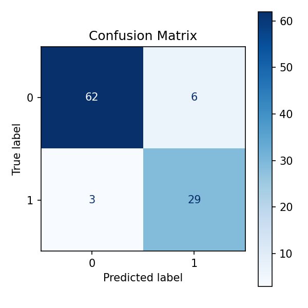

# 🌳 Purchase Prediction using Decision Tree Classification

This project demonstrates a **Decision Tree Classification model** to predict whether a user will **purchase a product** based on their **age** and **estimated salary**. The project is beginner-friendly and highlights how tree-based models make rule-based decisions.

---

## 📊 Dataset Description

The dataset used is **Social_Network_Ads.csv** and contains demographic information along with purchase decisions.

* **Independent Variables (Features):** 2  
* **Dependent Variable (Target):** 1  

Each row represents an individual user.

---

## 🧾 Data Dictionary

### 🔹 Independent Variables

| Feature          | Description                 |
|------------------|----------------------------|
| Age              | Age of the user            |
| EstimatedSalary  | Estimated annual salary    |

---

### 🎯 Dependent Variable

| Feature   | Description                         |
|-----------|-------------------------------------|
| Purchased | 0 = Not Purchased 1 = Purchased |

This is a **binary classification problem**.

---

## 🛠️ Project Steps (Copy_of_decision_tree_classification.ipynb)

1. Import required libraries 📦  
2. Load the dataset 📂  
3. Separate features and target ⚙️  
4. Apply feature scaling 🔄  
5. Train Decision Tree classifier 🌳  
6. Predict test set results 🔮  
7. Visualize training and test results 📈  

---

## 📊 Model Accuracy

**Accuracy: 91%**

## 📊 Visualize Model Prediction

### 🔹 Training Set Results

The model creates rule-based splits to separate purchasing and non-purchasing users.  
The irregular decision regions occur because the tree splits the data into rectangular regions.

---

### 🔹 Test Set Results

The decision boundary on test data shows how the model generalizes to unseen users.

---

## Confusion Matrix

A confusion matrix is a table used to evaluate the performance of a classification model. It shows the counts of correct and incorrect predictions for each class.

- **True Negatives (TN):** 62
- **False Positives (FP):** 6
- **False Negatives (FN):** 3
- **True Positives (TP):** 29

## ✅ Conclusion

The Decision Tree model classifies users by learning hierarchical decision rules.  
This project helps in understanding:

- Tree-based classification  
- Rule-based splitting  
- Overfitting tendencies  
- Decision boundary visualization

---

