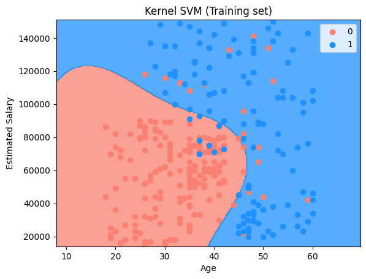
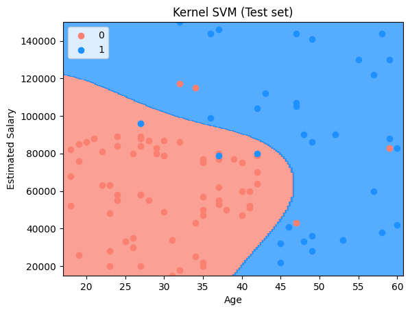
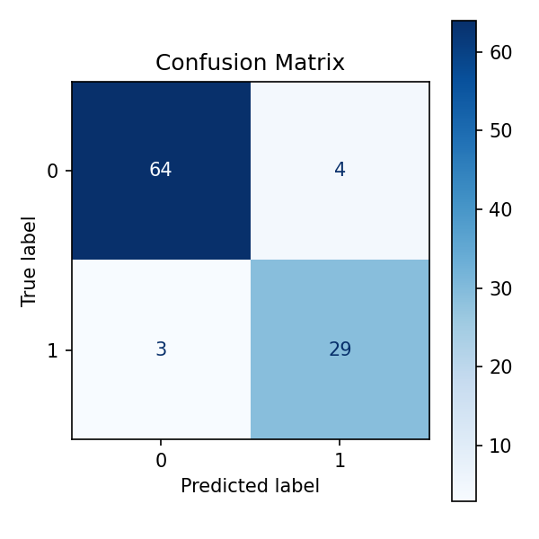

# 🧩 Purchase Prediction using Kernel Support Vector Machine (Kernel SVM)

This project demonstrates a **Kernel Support Vector Machine (Kernel SVM)** classification model to predict whether a user will **purchase a product** based on their **age** and **estimated salary**. The project focuses on handling **non-linear decision boundaries** using kernel functions.

---

## 📊 Dataset Description

The dataset used is **Social_Network_Ads.csv** and contains user demographic information along with their purchase decisions.

* **Independent Variables (Features):** 2  
* **Dependent Variable (Target):** 1  

Each row represents an individual user.

---

## 🧾 Data Dictionary

### 🔹 Independent Variables

| Feature          | Description                 |
|------------------|----------------------------|
| Age              | Age of the user            |
| EstimatedSalary  | Estimated annual salary    |

---

### 🎯 Dependent Variable

| Feature   | Description                         |
|-----------|-------------------------------------|
| Purchased | 0 = Not Purchased 1 = Purchased |

This is a **binary classification problem**.

---

## 🛠️ Project Steps (kernel_svm.ipynb)

1. Import required libraries 📦  
2. Load the dataset 📂  
3. Separate features and target ⚙️  
4. Apply feature scaling 🔄  
5. Train Kernel SVM classifier 🧩  
6. Predict test set results 🔮  
7. Visualize training and test results 📈  

---

## 📊 Model Accuracy

**Accuracy: 93%**

## 📊 Visualize Model Prediction

### 🔹 Training Set Results

This plot shows the non-linear decision boundary generated by the Kernel SVM on the training data:

* **Red region (0):** Predicted as not purchasing  
* **Blue region (1):** Predicted as purchasing  
* Data points represent actual users  

Kernel SVM uses a kernel function (e.g., RBF) to transform data into a higher-dimensional space, enabling separation of non-linearly separable classes.

---

### 🔹 Test Set Results

This plot visualizes how well the model generalizes to unseen test data.  
The curved decision boundary demonstrates Kernel SVM’s ability to capture complex patterns between age and salary.

---

## Confusion Matrix

A confusion matrix is a table used to evaluate the performance of a classification model. It shows the counts of correct and incorrect predictions for each class.

- **True Negatives (TN):** 64
- **False Positives (FP):** 4
- **False Negatives (FN):** 3
- **True Positives (TP):** 29

## ✅ Conclusion

The Kernel Support Vector Machine model effectively classifies users by handling **non-linear relationships** between features. This project strengthens understanding of:

- Kernel trick and non-linear transformation  
- Feature scaling importance  
- Decision boundary visualization  
- Binary classification modeling  

Kernel SVM is especially powerful when data is not linearly separable.

---

