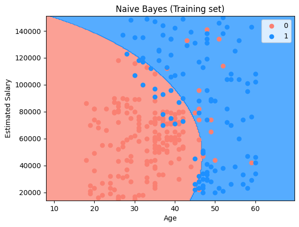
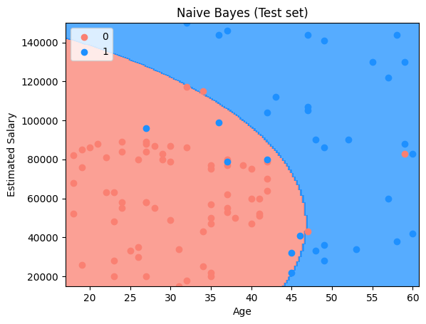
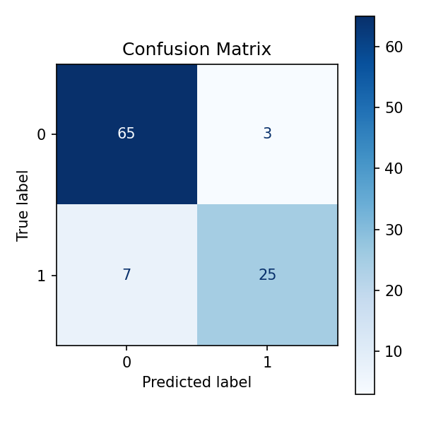

# 📊 Purchase Prediction using Naive Bayes Classification

This project demonstrates a **Naive Bayes classification model** to predict whether a user will **purchase a product** based on their **age** and **estimated salary**. The project is designed to be simple and beginner-friendly, focusing on probability-based classification.

---

## 📊 Dataset Description

The dataset used is **Social_Network_Ads.csv** and contains demographic information of users along with their purchase decisions.

* **Independent Variables (Features):** 2  
* **Dependent Variable (Target):** 1  

Each row represents an individual user.

---

## 🧾 Data Dictionary

### 🔹 Independent Variables

| Feature          | Description                 |
|------------------|----------------------------|
| Age              | Age of the user            |
| EstimatedSalary  | Estimated annual salary    |

---

### 🎯 Dependent Variable

| Feature   | Description                         |
|-----------|-------------------------------------|
| Purchased | 0 = Not Purchased 1 = Purchased |

This is a **binary classification problem**.

---

## 🛠️ Project Steps (naive_bayes.ipynb)

1. Import required libraries 📦  
2. Load the dataset 📂  
3. Separate features and target ⚙️  
4. Apply feature scaling 🔄  
5. Train Naive Bayes classifier 📊  
6. Predict test set results 🔮  
7. Visualize training and test results 📈  

---

## 📊 Model Accuracy

**Accuracy: 90%**

## 📊 Visualize Model Prediction

### 🔹 Training Set Results

This plot shows the decision boundary generated by the Naive Bayes model on the training data:

* **Red region (0):** Predicted as not purchasing  
* **Blue region (1):** Predicted as purchasing  
* Data points represent actual users  

Naive Bayes classifies data based on probability distributions and assumes independence between features.

---

### 🔹 Test Set Results

This plot visualizes how the model performs on unseen test data.  
The decision regions show how probability-based classification separates users based on age and salary.

---

## Confusion Matrix

A confusion matrix is a table used to evaluate the performance of a classification model. It shows the counts of correct and incorrect predictions for each class.

- **True Negatives (TN):** 65
- **False Positives (FP):** 3
- **False Negatives (FN):** 7
- **True Positives (TP):** 25

## ✅ Conclusion

The Naive Bayes model effectively classifies users by applying probabilistic reasoning under the independence assumption. This project helps in understanding:

- Probability-based classification  
- Feature independence assumption  
- Decision boundary visualization  
- Binary classification modeling  

Naive Bayes is simple, fast, and efficient for many classification problems.

---

