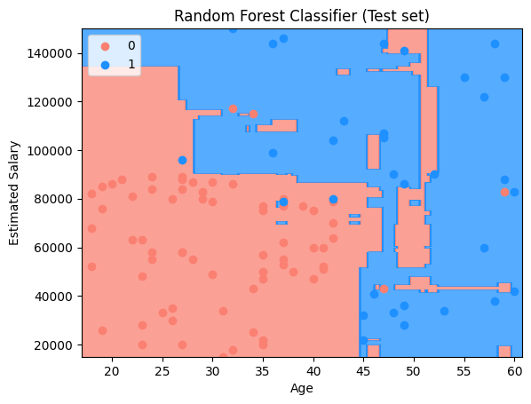
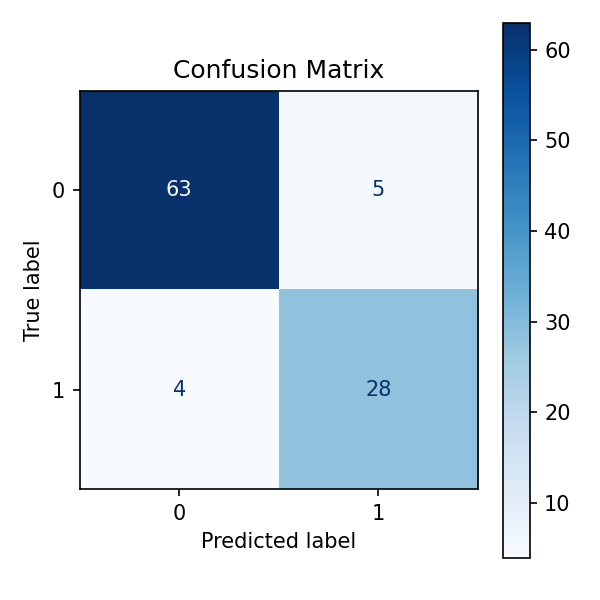

# 🌲 Purchase Prediction using Random Forest Classification

This project demonstrates a **Random Forest Classification model** to predict whether a user will **purchase a product** based on their **age** and **estimated salary**. The project highlights how ensemble learning improves classification performance.

---

## 📊 Dataset Description

The dataset used is **Social_Network_Ads.csv** and contains demographic information along with purchase decisions.

* **Independent Variables (Features):** 2  
* **Dependent Variable (Target):** 1  

Each row represents an individual user.

---

## 🧾 Data Dictionary

### 🔹 Independent Variables

| Feature          | Description                 |
|------------------|----------------------------|
| Age              | Age of the user            |
| EstimatedSalary  | Estimated annual salary    |

---

### 🎯 Dependent Variable

| Feature   | Description                         |
|-----------|-------------------------------------|
| Purchased | 0 = Not Purchased 1 = Purchased |

This is a **binary classification problem**.

---

## 🛠️ Project Steps (random_forest_classification.ipynb)

1. Import required libraries 📦  
2. Load the dataset 📂  
3. Separate features and target ⚙️  
4. Apply feature scaling 🔄  
5. Train Random Forest classifier 🌲  
6. Predict test set results 🔮  
7. Visualize training and test results 📈  

---

## 📊 Model Accuracy

**Accuracy: 91%**

## 📊 Visualize Model Prediction

### 🔹 Training Set Results

Random Forest builds multiple decision trees and combines their predictions.  
The decision regions are smoother compared to a single decision tree.

---

### 🔹 Test Set Results

The ensemble approach helps improve generalization on unseen data by reducing overfitting.

---

## Confusion Matrix

A confusion matrix is a table used to evaluate the performance of a classification model. It shows the counts of correct and incorrect predictions for each class.

- **True Negatives (TN):** 63
- **False Positives (FP):** 5
- **False Negatives (FN):** 4
- **True Positives (TP):** 28

## ✅ Conclusion

The Random Forest model improves classification accuracy by combining multiple decision trees.  
This project helps in understanding:

- Ensemble learning  
- Variance reduction  
- Improved generalization  
- Classification boundary visualization

---

