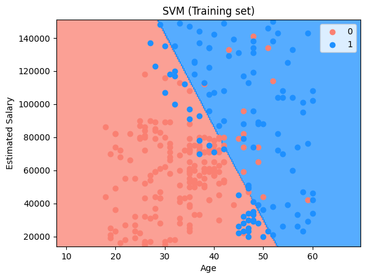

# ⚙️ Purchase Prediction using Support Vector Machine (SVM)

This project demonstrates a **Support Vector Machine (SVM) classification model** to predict whether a user will **purchase a product** based on their **age** and **estimated salary**. The project is designed to be simple and beginner-friendly, focusing on margin-based classification.

---

## 📊 Dataset Description

The dataset used is **Social_Network_Ads.csv** and contains demographic details of users along with their purchase decisions.

* **Independent Variables (Features):** 2  
* **Dependent Variable (Target):** 1  

Each row represents an individual user.

---

## 🧾 Data Dictionary

### 🔹 Independent Variables

| Feature          | Description                 |
|------------------|----------------------------|
| Age              | Age of the user            |
| EstimatedSalary  | Estimated annual salary    |

---

### 🎯 Dependent Variable

| Feature   | Description                         |
|-----------|-------------------------------------|
| Purchased | 0 = Not Purchased 1 = Purchased |

This is a **binary classification problem**.

---

## 🛠️ Project Steps (Copy_of_support_vector_machine.ipynb)

1. Import required libraries 📦  
2. Load the dataset 📂  
3. Separate features and target ⚙️  
4. Apply feature scaling 🔄  
5. Train Support Vector Machine classifier ⚙️  
6. Predict test set results 🔮  
7. Visualize training and test results 📈  

---

## 📊 Model Accuracy

**Accuracy: 90%**

## 📊 Visualize Model Prediction

### 🔹 Training Set Results

This plot shows the decision boundary created by the SVM model on the training data:

* **Red region (0):** Predicted as not purchasing  
* **Blue region (1):** Predicted as purchasing  
* Data points represent actual users  

SVM works by finding the optimal hyperplane that maximizes the margin between classes.

---

### 🔹 Test Set Results

This plot visualizes the model’s performance on unseen test data.  
The well-defined boundary indicates that SVM effectively separates the two classes based on age and salary.

---

## Confusion Matrix

A confusion matrix is a table used to evaluate the performance of a classification model. It shows the counts of correct and incorrect predictions for each class.

- **True Negatives (TN):** 66
- **False Positives (FP):** 2
- **False Negatives (FN):** 8
- **True Positives (TP):** 24

## ✅ Conclusion

The Support Vector Machine model successfully classifies users based on demographic features by maximizing the margin between classes. This project strengthens understanding of:

- Margin-based classification  
- Feature scaling importance  
- Decision boundary visualization  
- Binary classification evaluation  

SVM is particularly powerful when data is clearly separable and performs well in high-dimensional spaces.

---

