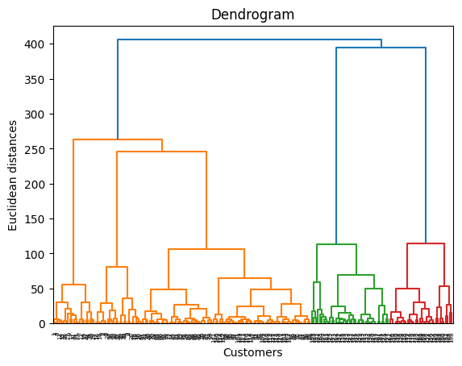
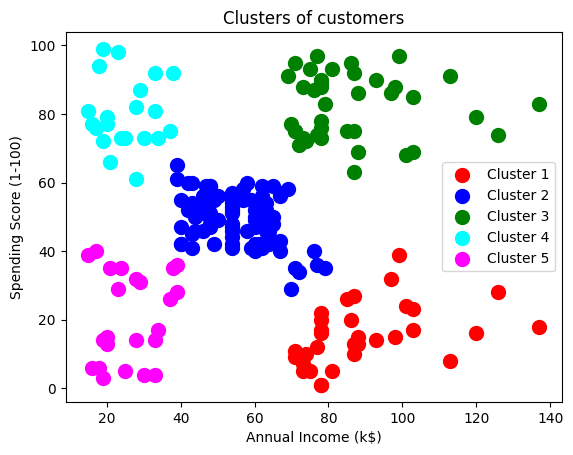

# 🧩 Customer Segmentation using Hierarchical Clustering

This project demonstrates a **Hierarchical Clustering model** to segment customers based on their **annual income** and **spending score**. The project focuses on understanding hierarchical relationships between data points and visualizing clusters using a dendrogram.

---

## 📊 Dataset Description

The dataset used is **Mall_Customers.csv** and contains customer demographic and spending information.

* **Independent Variables (Features):** 2 (used for clustering)
* **Dependent Variable (Target):** None (Unsupervised Learning)

Each row represents a customer in the mall.

---

## 🧾 Data Dictionary

### 🔹 Features Used for Clustering

| Feature               | Description                                      |
|-----------------------|--------------------------------------------------|
| Annual Income (k$)    | Annual income of the customer (in thousand $)   |
| Spending Score (1-100)| Score assigned based on spending behavior       |

> Hierarchical Clustering is an **unsupervised algorithm**, so there is no target variable.

---

## 🛠️ Project Steps (hierarchical_clustering.ipynb)

1. Import required libraries 📦  
2. Load the dataset 📂  
3. Select relevant features ⚙️  
4. Create Dendrogram 📊  
5. Determine optimal number of clusters 🔍  
6. Apply Agglomerative Hierarchical Clustering 🧪  
7. Visualize customer segments 📈  

---

## 📊 Dendrogram (Selecting Optimal Clusters)

A **dendrogram** is a tree-like diagram used to visualize hierarchical clustering.

### 📌 How to Select the Optimal Number of Clusters?

- Look for the **largest vertical distance** between horizontal lines.
- Draw a horizontal cut through that largest gap.
- The number of vertical lines intersected by this cut equals the number of clusters.

In this project, the largest vertical gap suggests **5 clusters**, so we select 5 customer segments.

---

## 📊 Visualize Customer Segments

The scatter plot shows:

- Different colored clusters representing customer groups  
- Grouping based on income and spending patterns  
- Clear separation of customer segments  

This segmentation helps businesses identify:

- Premium customers  
- Budget customers  
- Potential marketing targets  

---

## ✅ Conclusion

The Hierarchical Clustering model successfully segments customers by building a hierarchy of clusters and selecting the optimal number using a dendrogram.

This project strengthens understanding of:

- Agglomerative clustering  
- Dendrogram interpretation  
- Cluster selection using visual methods  
- Customer segmentation strategies  

Hierarchical clustering is particularly useful when the number of clusters is unknown and needs to be determined visually.
