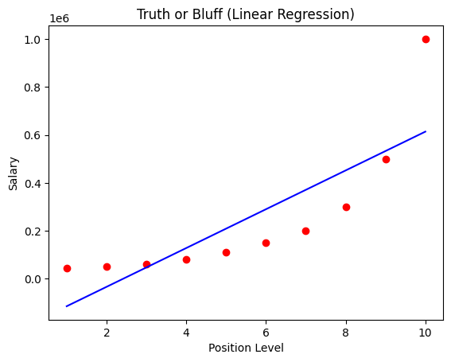
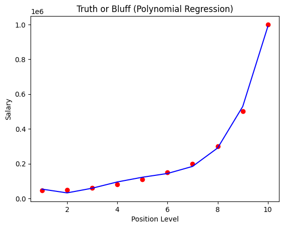

# 📊 Truth or Bluff Prediction using Linear and Polynomial Regression

This project demonstrates the difference between **Linear Regression** and **Polynomial Regression** for predicting **employee salary** based on **position level**. It highlights why Polynomial Regression is more suitable when the relationship between variables is **non-linear**.

---

## 📂 Dataset Description

The dataset used is **Position_Salaries.csv**.

* **Independent Variable (Feature):** 1
* **Dependent Variable (Target):** 1

Each row represents an employee position and its corresponding salary.

---

## 🧾 Data Dictionary

### 🔹 Independent Variable

| Feature | Description                    |
| ------- | ------------------------------ |
| Level   | Position level of the employee |

---

### 🎯 Dependent Variable

| Feature | Description                                |
| ------- | ------------------------------------------ |
| Salary  | Salary corresponding to the position level |

This is a **regression problem** with a continuous numerical output.

---

## 🛠️ Project Steps (Copy_of_polynomial_regression.ipynb)

1. Import required libraries 📦
2. Load the dataset 📂
3. Separate features and target ⚙️
4. Train Linear Regression model 🧪
5. Train Polynomial Regression model 🔁
6. Predict salary values 🔮
7. Visualize results 📈

---

## 📊 Model Visualizations

### 🔹 Linear Regression Result

The straight line shows that **Linear Regression cannot capture the curved salary trend**, leading to inaccurate predictions for higher position levels.

---

### 🔹 Polynomial Regression Result

The curved line closely follows the data points, showing that **Polynomial Regression models the non-linear relationship effectively** and provides more realistic predictions.

---

## 🔍 Model Comparison: Linear vs Polynomial Regression

| Aspect                      | Linear Regression           | Polynomial Regression           |
| --------------------------- | --------------------------- | ------------------------------- |
| Relationship type           | Assumes linear relationship | Handles non-linear relationship |
| Model shape                 | Straight line               | Curved line                     |
| Accuracy for this dataset   | Low                         | High                            |
| Ability to fit salary trend | Poor                        | Excellent                       |
| Suitable for this problem   | ❌ No                        | ✅ Yes                           |

---

## ✅ Conclusion

* Linear Regression fails to model the true salary growth pattern.
* Polynomial Regression successfully captures the **non-linear increase in salary** with position level.

This project clearly shows why **model selection based on data behavior** is critical in machine learning.
