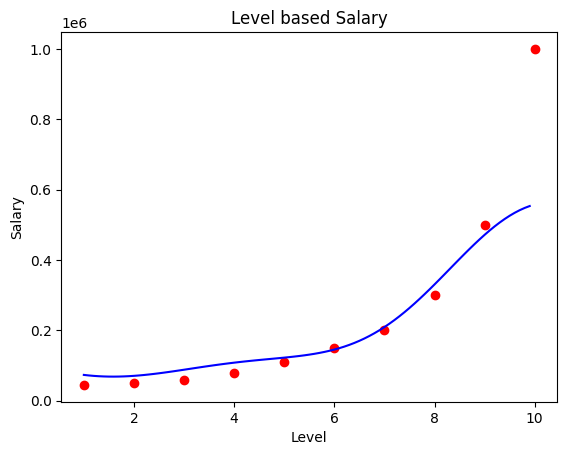

# 📈 Salary Prediction using Support Vector Regression (SVR)

This project demonstrates a **Support Vector Regression (SVR) model** to predict **employee salary** based on their **position level**. The project is designed to be **simple and beginner-friendly**, focusing on understanding non-linear regression.

---

## 📊 Dataset Description

The dataset used is **Position_Salaries.csv** and contains information about employee position levels and their corresponding salaries.

* **Independent Variables (Features):** 1  
* **Dependent Variable (Target):** 1  

Each row represents an employee role in an organization.

---

## 🧾 Data Dictionary

### 🔹 Independent Variable

| Feature | Description                     |
| ------ | ------------------------------- |
| Level  | Position level of the employee  |

---

### 🎯 Dependent Variable

| Feature | Description                        |
| ------ | ---------------------------------- |
| Salary | Salary corresponding to the level |

This is a **regression problem**, as the output is a continuous numerical value.

---

## 🛠️ Project Steps (Copy_of_support_vector_regression.ipynb)

1. Import required libraries 📦  
2. Load the dataset 📂  
3. Separate features and target ⚙️  
4. Apply feature scaling 🔄  
5. Train Support Vector Regression model 🧪  
6. Predict salary values 🔮  
7. Visualize model predictions 📈  

---

## 📊 Visualize Model Prediction

This plot visualizes the **relationship between position level and salary** learned by the model:

* **Red points:** Actual salary values from the dataset  
* **Blue curve:** Predicted salary trend generated by the model  

The curved trend shows that the model captures the **non-linear increase in salary with higher position levels**, making it suitable for level-based salary prediction.

## ✅ Conclusion

The Support Vector Regression model effectively predicts salaries by learning the **non-linear trend** in the data. This project is a strong foundation for understanding **kernel-based regression**, **feature scaling**, and **advanced regression techniques** in machine learning.
